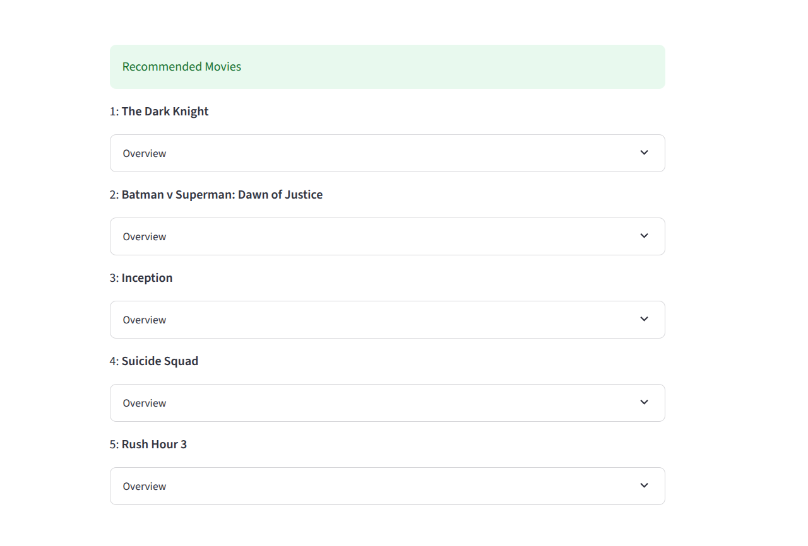

# Movie Recommendation System

This project is a hybrid web application that delivers movie recommendations using machine learning techniques. It features a **FastAPI backend** to serve the core recommendation logic and a **Streamlit frontend** for an interactive user interface.

---


---
## Project Overview

The Movie Recommendation System allows users to receive personalized movie suggestions based on content similarity. The backend uses a content-based filtering model built from movie overviews and embeddings. The frontend enables users to input movie titles and view top-N similar movies.

---

## Goals

- Build a fast and modular movie recommendation system.
- Expose recommendation functionality via a FastAPI REST API.
- Provide an easy-to-use frontend with Streamlit.
- Experiment with different vector similarity techniques (cosine similarity, etc.).

---

## Tech Stack

| Layer         | Tool/Framework       |
|---------------|----------------------|
| Backend       | FastAPI              |
| Frontend      | Streamlit            |
| Language      | Python               |
| ML Libraries  | Scikit-learn, NumPy, Pandas |
| Text Encoding | TF-IDF / Sentence Transformers |
| Data Handling | Pandas               |

---

## Dataset

The system is built on a cleaned version of the [MovieLens](https://grouplens.org/datasets/movielens/) dataset (or similar), containing:

- `title`: Movie title
- `overview`: Text description used for content similarity
- `genres`, `tags`: (Optional fields for enhancement)

Preprocessing and vectorization were done using TF-IDF or pre-trained sentence embeddings (customizable).

---

## How It Works

1. **Backend**:
    - Receives a movie title via FastAPI `/recommend` endpoint.
    - Computes similarity between input movie and all others using precomputed embeddings.
    - Returns top 5 most similar movies as JSON.

2. **Frontend**:
    - Streamlit app lets users enter a movie title.
    - Sends request to FastAPI and displays the recommendations.

3. **Embeddings**:
    - Movie overviews are converted into vector space using TF-IDF or sentence transformers.
    - Cosine similarity is used to find the most relevant recommendations.

---

## How to Run

### 1. Clone the repo

```
git clone https://github.com/your-username/recommender-system.git
cd recommender-system
```
### 2. Set up the virtual environment with uv
```
uv venv    
source .venv/bin/activate  # or .venv\Scripts\activate on Windows
uv pip install -r pyproject.toml  
```

### 3. Run the FastAPI backend

```
cd backend
uvicorn main:app --reload
```
### 4. Run the Streamlit frontend
```
cd ../frontend
streamlit run app.py
```


## Run with Docker

This project is also **Dockerized for easy deployment**. You can run both the backend and frontend via Docker with minimal setup.
### 1. Pull the Docker image

```bash
docker pull ashut212/recommender-system:latest
```

### 2. Run the container

```bash
docker run -p 8501:8501 -p 8000:8000 ashut212/recommender-system
```
### Docker Hub
```markdown
You can find the published image here:  
[https://hub.docker.com/r/ashut212/recommender-system](https://hub.docker.com/repository/docker/ashut212/recommender-system/general)

```